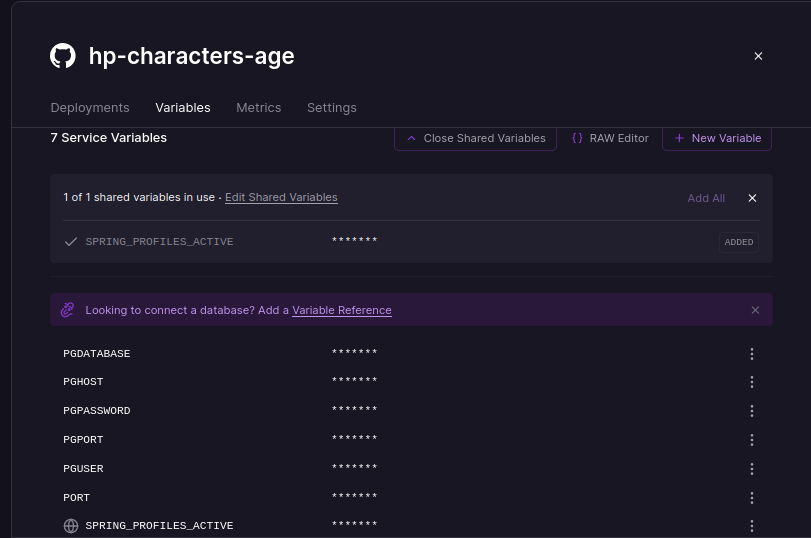

# Harry Potter characters's current age

## About

To practice the backend development I chose to use an [API](https://hp-api.onrender.com/) about one of my favorites histories, witch is Harry Potter's one.
It's a simple project that returns the current age of some of the characters.

You can interact with my project by the Swagger Interface in [this link](https://hp-prd.up.railway.app/swagger-ui/index.html).

### The API

Currently, the [HP-API](https://hp-api.onrender.com/) has information of 402 characters. Not everyone has all the information.
In this project it was used the follwoing attributes:

| Key	        | Type	    | Description                       |
|-------------|----------|-----------------------------------|
| id          | 	String	 | An identifier unique to each character. |
| name        | 	String	 | The name of the character.        |
| dateOfBirth | 	String  | 	Date of the character birth.     |

 

### Features
To develop this project, It was use the features bellow: 
* Java 17
* Spring Boot 3
* H2 Database
* PostgresSQL
* Maven
* Railway

That was the [Spring Boot Initializer](https://start.spring.io/#!type=maven-project&language=java&platformVersion=3.1.4&packaging=jar&jvmVersion=17&groupId=com.prisc&artifactId=hp-characters-age&name=hp-characters-age&description=Java%20RESTful%20API%20to%20practice%20with%20SpringBoot&packageName=com.prisc.hp-characters-age&dependencies=web,postgresql,data-jpa,h2,cloud-feign) configuration. 
The H2 Database and Swagger were used to tests along the development.
 

To connect to the remote Postgres and also to host the application on Railway, it's necessary to configure some variables at the platform:

